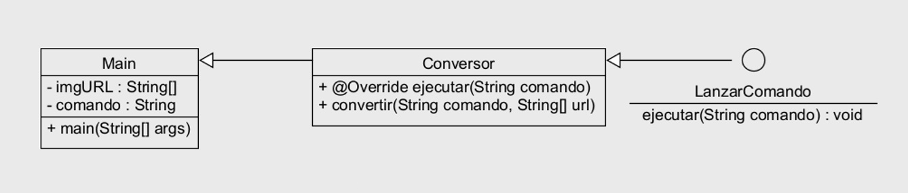

# Proyecto: Conversor de Imágenes con Java y ImageMagick

## 1. Descripción

Este proyecto permite convertir imágenes de un formato a otro usando Java y el comando convert de ImageMagick.

Incluye validación mínima de entradas y mensajes informativos.

## 2. Estructura del proyecto

src/
 └─ es/tierno/
      ├─ Main.java
      ├─ Conversor.java
      └─ LanzarComando.java
test/
 └─ es/tierno/
      └─ ConversorTest.java

## 3. Clases y métodos

- **3.1 Interfaz LanzarComando**
    ```java
    public interface LanzarComando {
        void ejecutar(String comando, String[] urls) throws IOException, InterruptedException;
    }
    ```


    Descripción: Define un contrato para ejecutar comandos externos.

    Métodos:

    | Método     | Parámetros                                                             | Descripción                                        |
    | ---------- | ---------------------------------------------------------------------- | -------------------------------------------------- |
    | `ejecutar` | `comando`: nombre del ejecutable o ruta<br>`urls`: array de argumentos | Ejecuta el comando externo y espera a que termine. |

- **3.2 Clase Conversor**

    ```java
    public class Conversor implements LanzarComando {

    private static final String MSG_SCS = "Comando ejectuado";
    private static final String MSG_ERR = "Se necesita al menos dos URL para ejecutar";
    private static final int NUM_URL = 2;

    @Override
    public void ejecutar(String comando, String[] urls) throws IOException, InterruptedException {
        if (urls == null || urls.length < NUM_URL) {
            System.out.println(MSG_ERR);
            return;
        }

        List<String> cmd = new ArrayList<>();
        cmd.add(comando);
        cmd.addAll(Arrays.asList(urls));

        ProcessBuilder pb = new ProcessBuilder(cmd);
        Process proceso = pb.start();
        proceso.waitFor();

        System.out.println(MSG_SCS);
    }
    ```


    Descripción: Implementa la interfaz LanzarComando y permite ejecutar comandos externos como convert.

- **3.3 Clase Main**
    ```java
    public class Main {
    public static void main(String[] args) throws IOException, InterruptedException{
        String[] urlStrings = {"src/main/resources/entrada.jpg", "src/main/resources/salida.png"};
        String comando = "convert";

        Conversor conversor = new Conversor();
        conversor.ejecutar(comando, urlStrings);
    }
    ```


    Descripción:

    - Clase principal que se ejecuta desde la línea de comandos.

    - Convierte una imagen de entrada a salida usando ImageMagick.

## 4. Cómo ejecutar el programa

Instalar ImageMagick

```bash
sudo apt-get update
sudo apt-get install imagemagick
```

Compilar el proyecto

```bash
javac -d bin src/es/tierno/*.java
```

Ejecutar la conversión

```bash
java -cp bin es.tierno.Main entrada.jpg salida.png
```

## 5. Tests con JUnit 5

| Test                               | Descripción                                                                              |
| ---------------------------------- | ---------------------------------------------------------------------------------------- |
| `testEjecutarConUrlsNulas`         | Verifica que se imprime mensaje de error si `urls == null`.                              |
| `testEjecutarConUrlsInsuficientes` | Verifica que se imprime error si `urls.length < NUM_URL`.                                |

## 6. Diagrama UML


